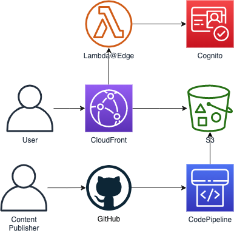

# Setting up an authenticated static site

This is an example CDK project that shows how you can set up an authenticated static site:

- Your web content is stored in a private Amazon S3 bucket, and served via Amazon CloudFront
- Users must sign-in with Amazon Cognito before being able to access the web content, this is enforced by AWS Lambda@Edge
- When a user navigates to a path that ends with a "/", Lambda@Edge makes sure we serve the index.html file in that directory
- You publish web content by committing it to a private GitHub repository
- The GitHub commit triggers AWS CodePipeline, and the new content is automatically uploaded to S3

Latest code version is available at: [https://github.com/aws-samples/authenticated-static-site](https://github.com/aws-samples/authenticated-static-site)

### Architecture diagram



### Authorization using Cognito and Lambda@Edge

The necessary Lambda@Edge functions, that enforce users to sign-in with Cognito, are provided by the reusable SAR Application [cloudfront-authorization-at-edge](https://github.com/aws-samples/cloudfront-authorization-at-edge). This SAR application is deployed as part of the example here, as a nested stack.

That solution also bundles a Lambda@Edge function that appends "index.html" to any paths ending with a "/", which we can reuse in our CloudFront distribution.

## Deploying this solution

### Prerequisites

- A private GitHub repository to connect with. Note, public works too, but probably defeats the purpose of this solution.
- An AWS account and credentials to deploy this solution.
- AWS CDK installed. Follow the installation guide [here](https://docs.aws.amazon.com/cdk/latest/guide/getting_started.html).

### 1. Create a connection with your GitHub repository

You GitHub repository needs to be set up to trigger AWS Code Pipeline. The solution here does that, but needs your AWS to be connected with your GitHub repository beforehand.

Follow the official AWS guide [here](https://docs.aws.amazon.com/codepipeline/latest/userguide/connections-github.html) to create a connection between your AWS account and the GitHub repository.

Take notes of the following, you need these in the next step:

- repository owner (e.g. your GitHub user name)
- repository name
- branch name to trigger off of
- connection ARN. After setting up the connection, you can find the connection ARN in the console [here](https://eu-west-1.console.aws.amazon.com/codesuite/settings/connections).

### 2. Deploy

There's 2 methods to deploy this app:

- Deploy from the Serverless Application Repository. This is probably the easiest way. Navigate to the [application in the Serverless Application Repository](https://console.aws.amazon.com/lambda/home?region=us-east-1#/create/app?applicationId=arn:aws:serverlessrepo:us-east-1:780040884205:applications/AuthenticatedStaticSite) and click Deploy.
- Deploy with AWS CDK. Follow the steps below.

#### AWS CDK Deployment

- Install dependencies:

```
npm install
```

- Run deployment. Provide the parameters from the the prior step:

```
cdk deploy --all \
        --parameters GitHubOwner=<repository owner> \
        --parameters GitHubRepo=<repository name> \
        --parameters GitHubBranch=<branch name> \
        --parameters GitHubConnectionARN=<connection ARN>
```

NB: the first time the command is run you may get something similar to:

```
AuthenticatedStaticSiteStack: deploying...
The template for stack "AuthenticatedStaticSiteStack" is 54KiB. Templates larger than 50KiB must be uploaded to S3.
Run the following command in order to setup an S3 bucket in this environment, and then re-deploy:
    $ cdk bootstrap aws://123456789012/eu-west-1
```

Just run the displayed bootstrap command and then rerun the deployment.
It will create a S3 bucket used to transfert the code to AWS.

After the deployment, the outputs of the CloudFormation stack are displayed, amongst which the URL with which you can access your web content.

```
http://<your cloudfront prefix>.cloudfront.net/
```

Note that if you go there, you'll be redirect to Cognito to sign-in.

### 3. Create users

[Create a user](https://docs.aws.amazon.com/cognito/latest/developerguide/how-to-create-user-accounts.html) for yourself, and others, to sign-in with, in the deployed Cognito User pool in the AWS console.

### 4. Publish content

Now, all you need to do, is create index.html, commit it to your GitHub repository, and wait for your content to be deployed and visible.
While you're at it, also commit a file notfound.html––that will be shown if a user accesses a non-existent path (instead of the CloudFront 404 XML message).

## Clean Up

If you deployed the application from the Serverless Application Repository, then navigate to AWS CloudFormation in the AWS console and delete the stack.

If you used CDK to deploy, you can also clean up the stack and all resource like so:

```
cdk destroy --all
```

Note1: that the Lambda@Edge functions might fail deletion at first, because they are replicated to all regions. After a little while, simply try deleting them again, by deleting the stack from the CloudFormation console.
Note2: the provided code will try to remove: S3 Buckets, Cognito User Pool. It will fail if these resources are not empty.


## Security

See [CONTRIBUTING](CONTRIBUTING.md#security-issue-notifications) for more information.

## License

This library is licensed under the MIT-0 License. See the [LICENSE](LICENSE) file.
